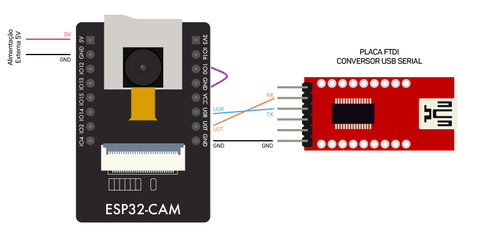
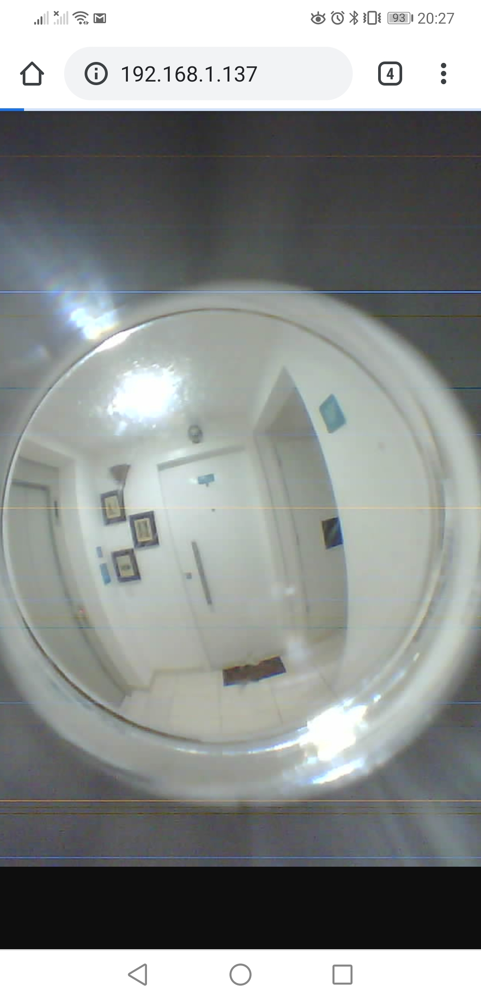
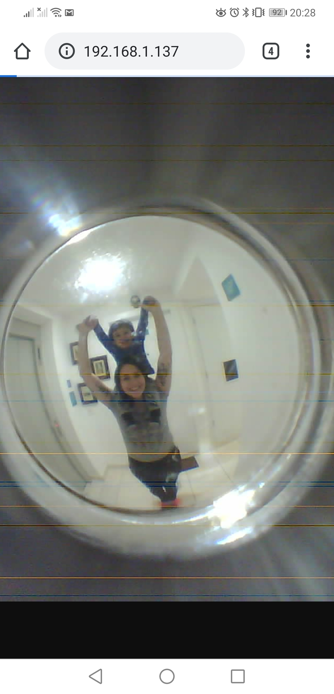
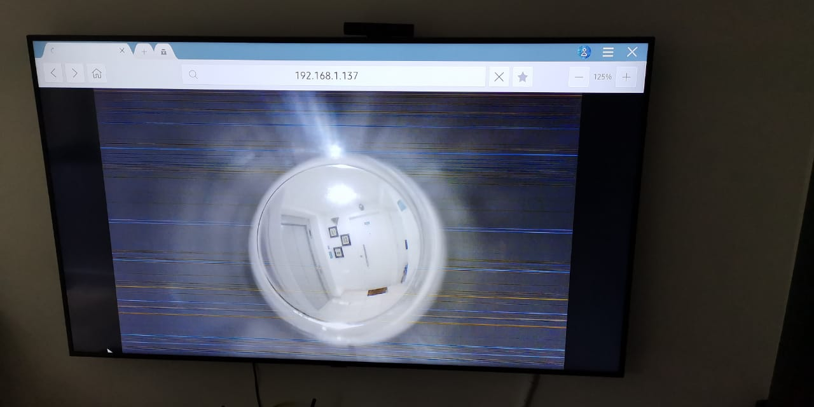

# olhoMagico

Esse projeto foi feito baseado em um ESP32-Cam.

A proposta do projeto é que o olho mágico da porta do meu apartamento, seja visível de qualquer lugar através de um IP interno da minha rede.

## Conexões

Foi usada a biblioteca da ESP32 com a versão 1.0.4
[link para gerenciador da placa!](https://dl.espressif.com/dl/package_esp32_index.json)

### Configurações importantes
 - Em Placa selecione "ESP32 Wrover Module"
 - Em Partion Scheme selecione "Huge APP (3MB No OTA)"

# Resultado
### Celular:

### TV
